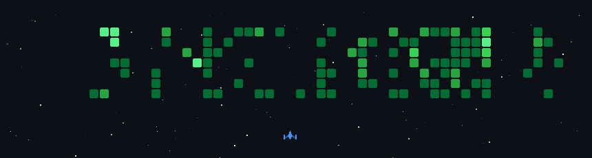

## About me     👋 Hello!  
I'm currently studying in the **Bachelor of Industrial Technology Program in Information Technology**  
at **King Mongkut's University of Technology North Bangkok (KMUTNB)**.

My academic focus includes software development, database systems, and information technology.  
I’m always ready to learn and improve myself ✨

🌱 I’m currently learning more about web development and database-driven systems.

Thanks for visiting my GitHub profile!

<h2>Tech Stack</h2> 

 

<!--

-->

